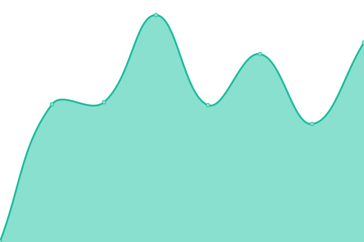
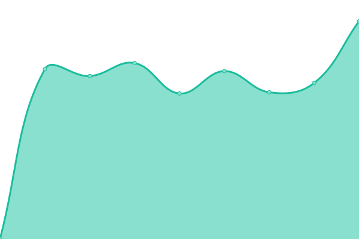
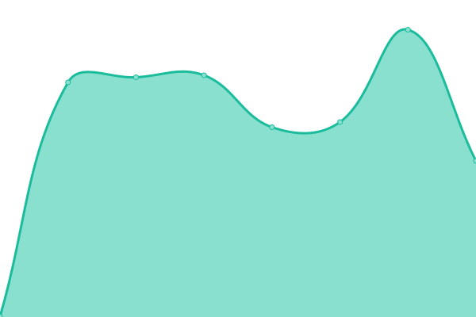
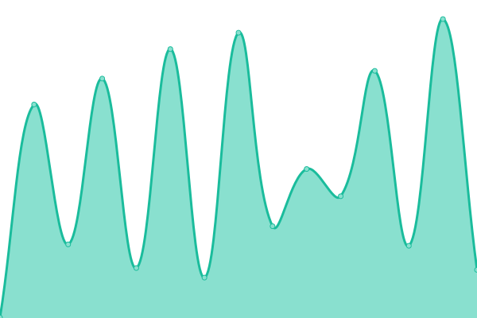
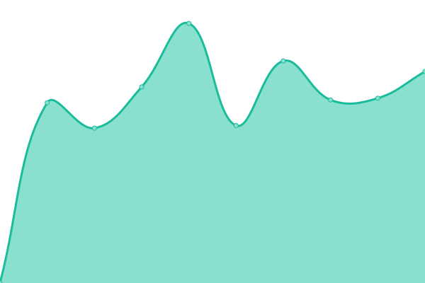

# [📈 Live Status](https://uptimch.github.io/uptim): <!--live status--> **🟩 All systems operational**

This repository contains the open-source uptime monitor and status page for [uptimch](https://uptimch.github.io/uptim), powered by [Upptime](https://github.com/upptime/upptime).

With [Upptime](https://upptime.js.org), you can get your own unlimited and free uptime monitor and status page, powered entirely by a GitHub repository. We use [Issues](https://github.com/uptimch/uptim/issues) as incident reports, [Actions](https://github.com/uptimch/uptim/actions) as uptime monitors, and [Pages](https://uptimch.github.io/uptim) for the status page.

<!--start: status pages-->
<!-- This summary is generated by Upptime (https://github.com/upptime/upptime) -->
<!-- Do not edit this manually, your changes will be overwritten -->
<!-- prettier-ignore -->
| URL | Status | History | Response Time | Uptime |
| --- | ------ | ------- | ------------- | ------ |
|  [Tim](https://www.timvonfelten.ch) | 🟩 Up | [tim.yml](https://github.com/uptimch/uptim/commits/HEAD/history/tim.yml) | 

 625ms
     
 | 

<a href="https://uptimch.github.io/uptim/history/tim">100.00%</a>
    

|  [Blankenburg](https://blankenburg.ch) | 🟩 Up | [blankenburg.yml](https://github.com/uptimch/uptim/commits/HEAD/history/blankenburg.yml) | 

 549ms
     
 | 

<a href="https://uptimch.github.io/uptim/history/blankenburg">100.00%</a>
    

|  [von Felten](https://vonfelten.ch) | 🟩 Up | [von-felten.yml](https://github.com/uptimch/uptim/commits/HEAD/history/von-felten.yml) | 

 540ms
     
 | 

<a href="https://uptimch.github.io/uptim/history/von-felten">100.00%</a>
    

|  [Galerie de Grandcour](https://www.galerie-de-grandcour.ch/) | 🟩 Up | [galerie-de-grandcour.yml](https://github.com/uptimch/uptim/commits/HEAD/history/galerie-de-grandcour.yml) | 

 623ms
     
 | 

<a href="https://uptimch.github.io/uptim/history/galerie-de-grandcour">100.00%</a>
    

|  [MOV Physiotherapie](https://movphysio.ch) | 🟩 Up | [mov-physiotherapie.yml](https://github.com/uptimch/uptim/commits/HEAD/history/mov-physiotherapie.yml) | 

 1308ms
     
 | 

<a href="https://uptimch.github.io/uptim/history/mov-physiotherapie">100.00%</a>
    

|  [Badmintonclub Gstaad](https://www.badmintonclubgstaad.ch/) | 🟩 Up | [badmintonclub-gstaad.yml](https://github.com/uptimch/uptim/commits/HEAD/history/badmintonclub-gstaad.yml) | 

 577ms
     
 | 

<a href="https://uptimch.github.io/uptim/history/badmintonclub-gstaad">100.00%</a>
    

|  [Erlenhüttli](https://www.erlenhuettli.ch/de) | 🟩 Up | [erlenhuettli.yml](https://github.com/uptimch/uptim/commits/HEAD/history/erlenhuettli.yml) | 

 692ms
     
 | 

<a href="https://uptimch.github.io/uptim/history/erlenhuettli">100.00%</a>
    

|  [G2021](https://g2021.ch/) | 🟩 Up | [g2021.yml](https://github.com/uptimch/uptim/commits/HEAD/history/g2021.yml) | 

 567ms
     
 | 

<a href="https://uptimch.github.io/uptim/history/g2021">100.00%</a>
    

|  [Red Monkey Surf](https://redmonkeysurf.wixsite.com/red-monkey-surf) | 🟩 Up | [red-monkey-surf.yml](https://github.com/uptimch/uptim/commits/HEAD/history/red-monkey-surf.yml) | 

 275ms
     
 | 

<a href="https://uptimch.github.io/uptim/history/red-monkey-surf">100.00%</a>
    

|  [TriTeam Steffisburg](https://www.tristeffisburg.ch/) | 🟩 Up | [tri-team-steffisburg.yml](https://github.com/uptimch/uptim/commits/HEAD/history/tri-team-steffisburg.yml) | 

 1892ms
     
 | 

<a href="https://uptimch.github.io/uptim/history/tri-team-steffisburg">100.00%</a>
    

|  [TROAG](https://troag.ch/) | 🟩 Up | [troag.yml](https://github.com/uptimch/uptim/commits/HEAD/history/troag.yml) | 

 2022ms
     
 | 

<a href="https://uptimch.github.io/uptim/history/troag">100.00%</a>
    

|  [TriTeamSteffisburg](https://www.tristeffisburg.ch/) | 🟩 Up | [tri-team-steffisburg.yml](https://github.com/uptimch/uptim/commits/HEAD/history/tri-team-steffisburg.yml) | 

 1892ms
     
 | 

<a href="https://uptimch.github.io/uptim/history/tri-team-steffisburg">100.00%</a>
    

<!--end: status pages-->

[**Visit our status website →**](https://uptimch.github.io/uptim)

## 📄 License

- Powered by: [Upptime](https://github.com/upptime/upptime)
- Code: [MIT](./LICENSE) © [Anand Chowdhary](https://anandchowdhary.com), supported by [Pabio](https://pabio.com)
- Data in the `./history` directory: [Open Database License](https://opendatacommons.org/licenses/odbl/1-0/)
